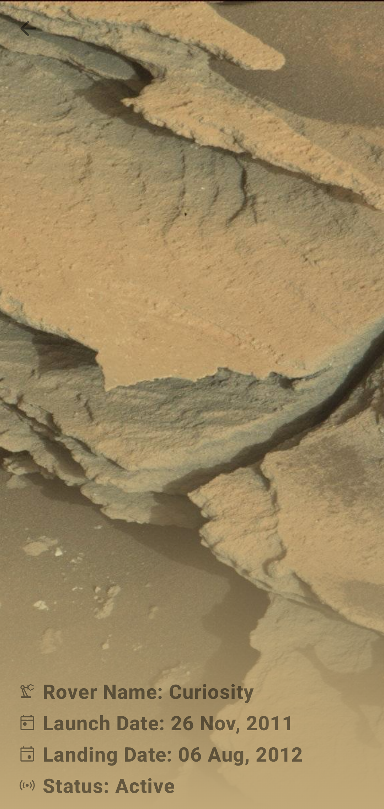

# MARS ROVER PHOTOS

An android app built using Kotlin that consumes [NASA's API](https://api.nasa.gov/) to Mars photos captured by Curiosity, Spirit and Opportunity rovers. It has been built following Clean Architecture Principle, Repository Pattern, MVVM Architecture in the presentation layer as well as Jetpack components.

## Table Of Content

- [MARS ROVER PHOTOS](#mars-rover-photos)
  - [Table Of Content](#table-of-content)
  - [Prerequisite](#prerequisite)
  - [Architecture](#architecture)
    - [1. Domain](#1-domain)
    - [2. Data](#2-data)
    - [3. Presentation](#3-presentation)
  - [Tech Stack](#tech-stack)
    - [Libraries](#libraries)
    - [Extras](#extras)
  - [Screenshots](#screenshots)

## Prerequisite

To run the app from Android Studio on your local machine you'll need to add `api_key` value in your `local.properties` file

The API key can be generated from this [link](https://api.nasa.gov/).

## Architecture

The app is split into 3 layer:

### 1. Domain

This is the core layer of the application. The domain layer is independent of any other layers thus domain models and business logic can be independent from other layers.This means that changes in other layers will have no effect on domain layer eg. screen UI (presentation layer) or changing database (data layer) will not result in any code change in domain layer.

Components of domain layer include:

- ___Models___: Defines the core structure of the data that will be used within the application.

- ___Repositories___: Interfaces used by the data sources classes implemented in the data layer.

### 2. Data

The data layer is responsibile for selecting the proper data source for the domain layer. It contains the implementations of the repositories declared in the domain layer.

Components of data layer include:

- ___Models___: Network models eg. RoverDto
- ___Repositories___: Responsible for exposing data to the domain layer.
- ___Mappers___: They perform data transformation between domain and dto models.
- ___Network___: This is responsible for performing network operations eg. defining API endpoints using Ktor.
- ___Data Sources___: Responsible for deciding which data to fetch from data sources eg. network or cache.

### 3. Presentation

The presentation layer contains components involved in displaying information to the user. The main part of this layer are the composables(activity and screens) and viewmodels.

## Tech Stack

### Libraries

__UI__

- [Koin](https://github.com/google/hilt) - Dependency Injection framework
- [Compose](https://developer.android.com/jetpack/compose) - Modern toolkitfor building native UI.
- [Palette API](https://developer.android.com/develop/ui/views/graphics/palette-colors) - Generate color palette from images
- [Coil](https://coil-kt.github.io/coil/) - Load images from network source.
- [Compose Navigation](https://developer.android.com/jetpack/compose/navigation) - Navigation to composables.
  
__Data__

- [Ktor Client](https://ktor.io/)
- [KotlinX Serialization](https://github.com/Kotlin/kotlinx.serialization) - Serialization/Desirialization of JSON response from network.
- [Paging 3](https://developer.android.com/topic/libraries/architecture/paging/v3-overview) - Paging data fetched from network source.

__Testing__

- [jUnit](https://junit.org/junit4/)
- [Mockk](https://mockk.io/) - Mocking library for Kotlin.
- [Robolectric](https://robolectric.org/) - Framework used to quickly and reliably run unit tests quick using the JVM

__Plugins__

- [KtLint](https://github.com/pinterest/ktlint) - Kotlin linter.
- [Detekt](https://github.com/detekt/detekt) - Static code analysis tool for the Kotlin programming language
- [KotlinX Kover](https://github.com/Kotlin/kotlinx-kover) - Gradle plugin for Kotlin code coverage tools.

### Extras

This projects uses [GitHub actions](https://github.com/VictorKabata/MARS-ROVER-PHOTOS/actions) to run a build and execute all tests when creating a new PR.

## Screenshots

  
  
